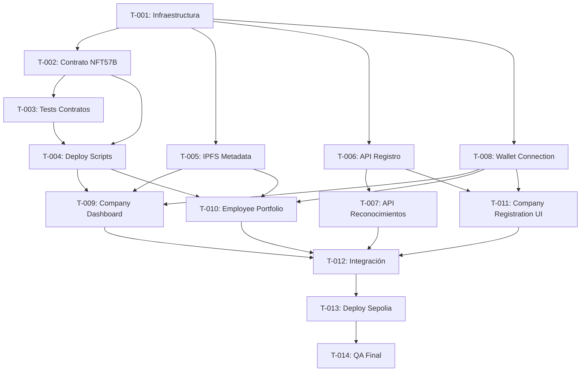

# Global Task Breakdown — Employee Recognition NFT Platform

> **Nota**: Este desglose es la vista global del proyecto completo.
> Cada tarea se implementa de a una. Una tarea no comienza hasta que la anterior esté 100% completa y verificada.
>
> Convención de estimaciones:
> - **< 1d** = menos de un día hábil (4-6h efectivas)
> - **~1d** = un día hábil completo
> - **~1.5d** = día y medio
> - **~2d** = dos días hábiles
>
> Incluye siempre: código + tests + documentación técnica mínima.

---

## Fase 0: Scaffold & Tooling

### T-001: Infraestructura del monorepo

Dependencias: _ninguna_
Estimación: **< 1d**

Configurar la base del proyecto: tooling, dependencias y variables de entorno para que las tres capas (hardhat, web-app, backend) compartan configuración.

**Subtareas:**
- [ ] Configurar pnpm workspaces en la raíz para hardhat/, web-app/, backend/
- [ ] Crear/actualizar `.gitignore` raíz con `node_modules/`, `.env`, `package-lock.json`, `yarn.lock`
- [ ] Configurar archivos `.env.example` en hardhat/ y web-app/ con todas las keys necesarias (SEPOLIA_RPC_URL, ETHERSCAN_API_KEY, VITE_CONTRACT_ADDRESS, PINATA_API_KEY, etc.)
- [ ] Instalar dependencias faltantes en web-app: `wagmi`, `viem`, `@tanstack/react-query`
- [ ] Configurar TypeScript estricto en web-app (ya existe tsconfig.app.json — verificar que strict mode esté activo)
- [ ] Verificar que `pnpm install` en raíz resuelve todas las dependencias sin errores
- [ ] Validar que `pnpm build` en web-app compila sin errores (probar con el scaffold actual)

---

## Fase 1: Smart Contracts

### T-002: Contrato principal NFT57B (ERC-721 + AccessControl + Pausable)

Dependencias: T-001
Estimación: **~2d**

Implementar el contrato ERC-721 core con metadata URI storage, control de acceso basado en roles, política non-transferable (empleados no pueden transferir), y emergency pause.

**Subtareas:**
- [x] Implementar `NFT57B.sol`:
  - OpenZeppelin `ERC721URIStorage` + `ERC721Enumerable` ✅
  - `AccessControl` con `DEFAULT_ADMIN_ROLE` (MINTER_ROLE movido a CompanyRegistry vía refactor) ⚠️
  - `Pausable` para emergency stop ✅
  - `_update` override (OZ v5) que solo permite transfers desde/hacia `address(0)` — salvo admin ✅
  - Función `safeMint(address to, string uri)` restringida a `CompanyRegistry` (no MINTER_ROLE) ⚠️
  - Función `burn(uint256 tokenId)` restringida a `DEFAULT_ADMIN_ROLE` ✅
  - Eventos personalizados + función `claim()` para reward orchestration extra ✅
  - `supportsInterface` excluye AccessControl intencionalmente ⚠️
- [x] Implementar `MetadataBuilder.sol` (library) — URI con estructura JSON estándar OpenSea ✅
- [x] Implementar `CompanyRegistry.sol` — registro + reward orchestration:
  - Registro de compañías con metadata on-chain ✅
  - Creadas directamente activas (sin aprobación super-admin) ⚠️
  - `recognize()` + `onClaimed()` para orquestación de rewards ⭐ extra
  - Sistema de registro de empleados ⭐ extra
  - Integración con BonusReward y RecognitionToken ⭐ extra
- [x] Compilar y verificar: `npx hardhat compile` pasa sin errores ✅
- [ ] Ejecutar análisis con `slither` — pendiente, requiere instalación

> **Nota:** La implementación real evolucionó respecto al plan original. Se refactorizó la autoridad de minteo de NFT57B a CompanyRegistry, y se agregaron BonusReward, RecognitionToken, y reward orchestration. El Task.md documenta el plan original — los contratos reflejan una arquitectura más madura.

### T-003: Tests de smart contracts

Dependencias: T-002
Estimación: **~1.5d**

Suite completa de tests unitarios e integración para todos los contratos. Cobertura mínima: 90%+ líneas.

**Subtareas:**
- [x] Tests unitarios de `NFT57B` (344 líneas, `NFT57B.test.ts`):
  - Mint exitoso vía CompanyRegistry (MINTER_ROLE reemplazado por `onlyCompanyRegistry`) ✅
  - Rechazo de mint sin CompanyRegistry ✅
  - Rechazo de transferencia entre empleados (non-transferable policy) ✅
  - Excepción: transferencia permitida desde/hacia address(0) ✅
  - Burn por DEFAULT_ADMIN_ROLE ✅
  - Pause / unpause por DEFAULT_ADMIN_ROLE ✅
  - Rechazo de mint cuando el contrato está pausado ✅
- [x] Tests de `MetadataBuilder` (155 líneas, `MetadataBuilder.test.ts`) ✅
- [x] Tests de `CompanyRegistry` (364 líneas, `CompanyRegistry.test.ts`):
  - Registro de nueva compañía ✅
  - Registro de empleados ✅
  - Recognize flow (reemplaza "asignar minter") ✅
  - Acceso restringido ✅
- [x] Tests de integración (639 líneas, `RewardsIntegration.test.ts`):
  - Flujo completo: registrar compañía → empleado → recognize → claim ✅
  - Eventos y edge cases ✅
- [x] Tests adicionales extra-plan:
  - `BonusReward.test.ts` (235 líneas) ⭐
  - `RecognitionToken.test.ts` (324 líneas) ⭐
- [x] Generar reporte de cobertura con `npx hardhat coverage` ✅
- [x] Cobertura general: **~91%** (excluyendo contract.sol eliminado) ✅
  - NFT57B: 97%, CompanyRegistry: 83%, MetadataBuilder: 100%
  - ⚠️ CompanyRegistry está en 83% — ideal subir a 90%+

> **Nota:** Los tests se actualizaron junto con los refactors de contratos. Los tests reflejan la arquitectura actual (CompanyRegistry como autoridad de minteo, reward orchestration). 64 tests pasando, todos verdes.

### T-004: Deploy scripts con Hardhat Ignition

Dependencias: T-002, T-003
Estimación: **< 1d**

Configurar módulos declarativos de deploy para todas las redes (localhost, Sepolia).

**Subtareas:**
- [ ] Crear módulo Ignition `NFT57B.ts` con:
  - Deploy de `NFT57B` con parámetros iniciales (nombre, símbolo, super-admin)
  - Deploy de `CompanyRegistry` vinculado al contrato principal
- [ ] Configurar script de deploy a localhost + script de seed data (compañía de prueba, minter, empleado con NFT)
- [ ] Configurar deploy a Sepolia con verificación automática en Etherscan
- [ ] Probar deploy completo en hardhat local + verificar que los contratos están operativos con una interacción de prueba
- [ ] Documentar en un `DEPLOY.md` los pasos para deploy a cada red

---

## Fase 2: Metadata & Almacenamiento

### T-005: Infraestructura IPFS para metadata

Dependencias: T-001
Estimación: **~1d**

Configurar el pipeline de subida y resolución de metadata NFT en IPFS.

**Subtareas:**
- [ ] Elegir proveedor (Pinata o Filebase), crear cuenta y configurar API keys en `.env`
- [ ] Crear script/helper en `scripts/` para subir metadata JSON a IPFS y obtener el CID
- [ ] Implementar utility `web-app/src/utils/metadata.ts`:
  - Función `uploadMetadata(achievement)` que sube a IPFS y retorna URI
  - Función `formatTokenURI(cid)` que construye la URI completa
- [ ] Implementar utility `web-app/src/utils/ipfs.ts` para resolver y cachear metadatos desde IPFS gateway
- [ ] Agregar tests para los utils de metadata (mock de IPFS)
- [ ] Documentar el flujo de metadata en el README (qué se sube, cuándo, cómo se resuelve)

---

## Fase 3: Backend API

### T-006: API de registro de compañías (Backend)

Dependencias: T-001
Estimación: **~1.5d**

Backend off-chain para registro de compañías con flujo KYC-light y aprobación.

**Subtareas:**
- [ ] Scaffold del proyecto `backend/` con Node.js + TypeScript + Express (o Hono)
- [ ] Configurar base de datos (SQLite para desarrollo, PostgreSQL para producción) con Drizzle ORM o Prisma
- [ ] Crear schema: `companies` (id, name, walletAddress, adminEmail, status: pending|approved|rejected, createdAt)
- [ ] Endpoint `POST /api/companies/register` — registro de nueva compañía
- [ ] Endpoint `GET /api/companies/:id` — consultar estado de registro
- [ ] Endpoint `GET /api/companies/pending` (admin only) — listar compañías pendientes
- [ ] Endpoint `PATCH /api/companies/:id/approve` (admin only) — aprobar/rechazar compañía
- [ ] Endpoint `POST /api/companies/:id/minters` — asignar wallet de minter a la compañía (gatilla el grant de MINTER_ROLE en el contrato)
- [ ] Tests de integración para todos los endpoints
- [ ] Validación de inputs (zod)
- [ ] Manejo de errores consistente

### T-007: API de reconocimientos y metadata (Backend)

Dependencias: T-006
Estimación: **~1d**

Endpoints para consultar reconocimientos, resolver metadata, y servir datos agregados al frontend.

**Subtareas:**
- [ ] Endpoint `GET /api/recognitions/employee/:walletAddress` — listar reconocimientos de un empleado (delegar a contrato + enriquecer con metadata)
- [ ] Endpoint `GET /api/recognitions/company/:companyId` — listar NFTs emitidos por una compañía
- [ ] Endpoint `GET /api/recognitions/:tokenId/metadata` — resolver metadata completa del token (incluyendo datos off-chain si aplica)
- [ ] Cache layer para metadata IPFS (evitar fetear IPFS en cada request)
- [ ] Tests de integración para todos los endpoints
- [ ] Swagger/OpenAPI docs básica

---

## Fase 4: Frontend — Core

### T-008: Wallet Connection & Config (wagmi + viem)

Dependencias: T-001
Estimación: **~1d**

Configurar la capa de conexión a wallet que toda la dApp necesita.

**Subtareas:**
- [ ] Configurar wagmi provider con `createConfig`:
  - Soportar MetaMask, WalletConnect, Coinbase Wallet
  - Redes: Hardhat local (31337) + Sepolia (11155111)
  - Auto-switch de red basado en `VITE_ACTIVE_NETWORK` env var
- [ ] Implementar hook `useWalletConnection`:
  - Estado de conexión (connect/disconnect)
  - Detección de red actual
  - Switch network si es necesario
- [ ] Implementar hook `useUserRole`:
  - Detectar si la wallet conectada es company admin, minter, o employee
  - Basado en `AccessControl` del contrato + `CompanyRegistry`
- [ ] Componente `ConnectButton` con estados: disconnected, connecting, connected (con dirección truncada)
- [ ] Componente `NetworkBadge` que muestra la red activa y alerta si no es la correcta
- [ ] Layout básico con header + sidebar de navegación condicional según rol

### T-009: Vista de Company Dashboard

Dependencias: T-004, T-008
Estimación: **~2d**

Dashboard administrativo para que RRHH/Company pueda gestionar reconocimientos.

**Subtareas:**
- [ ] Implementar hook `useCompanyMinters` — listar wallets con MINTER_ROLE asignadas a la compañía
- [ ] Implementar hook `useMintNFT` — write contract interaction para mintear NFT
  - Formulario: employee wallet address, título, descripción, valor, nombre del empleado
  - Integración con IPFS: subir metadata antes de mintear
  - Estados: pending tx, confirmando, exitoso, error
- [ ] Implementar hook `useCompanyNFTs` — listar todos los NFTs emitidos por la compañía con `ERC721Enumerable`
- [ ] Componente `MintNFTForm`:
  - Validación de dirección wallet del empleado
  - Preview de metadata antes de mintear
  - Indicador de gas estimado
- [ ] Componente `NFTTable` — tabla de NFTs emitidos con filtros (fecha, empleado, valor)
- [ ] Componente `EmployeeList` — listar empleados que han recibido NFTs de esta compañía
- [ ] Vista `CompanyDashboard` que integra todos los componentes
- [ ] Tests de componentes con React Testing Library (o Vitest)

### T-010: Vista de Employee Portfolio

Dependencias: T-004, T-008
Estimación: **~1.5d**

Vista para que el empleado conecte su wallet y vea sus reconocimientos.

**Subtareas:**
- [ ] Implementar hook `useEmployeeNFTs` — obtener tokens del empleado via `balanceOf` + `tokenOfOwnerByIndex`
- [ ] Implementar hook `useTokenMetadata` — resolver metadata desde tokenURI (IPFS fetch + cache)
- [ ] Componente `NFTGallery` — grid de NFTs con:
  - Card visual con título, valor, fecha
  - Loading skeleton mientras resuelve metadata
  - Empty state si no tiene NFTs
- [ ] Componente `NFTDetail` — modal o página expandida con metadata completa
- [ ] Componente `RecognitionBadge` — badge visual del logro
- [ ] Filtros: por fecha, por valor, por compañía emisora
- [ ] Vista `EmployeePortfolio` que integra gallery + detail
- [ ] Tests de componentes

### T-011: Vista de Company Registration (Frontend)

Dependencias: T-006, T-008
Estimación: **< 1d**

Formulario de registro para nuevas compañías.

**Subtareas:**
- [ ] Componente `CompanyRegistrationForm`:
  - Campos: company name, admin wallet (conectada), admin email
  - Validación de formulario
  - Submit al backend API (`POST /api/companies/register`)
- [ ] Estados: registering, success (con instrucciones de seguimiento), error
- [ ] Componente `RegistrationStatus` — consultar estado del registro (pending/approved/rejected)
- [ ] Vista `CompanyRegistration` page

---

## Fase 5: Integración & Deploy

### T-012: Integración Frontend-Backend-Contracts

Dependencias: T-007, T-009, T-010, T-011
Estimación: **~1d**

Conectar todas las capas y verificar que los flujos completos funcionan.

**Subtareas:**
- [ ] Integrar flujo de registro: CompanyRegistration → API → contrato (grant MINTER_ROLE)
- [ ] Integrar flujo de minteo: CompanyDashboard → IPFS upload → contrato safeMint → confirmación en UI
- [ ] Integrar flujo de employee: EmployeePortfolio → contrato balanceOf → IPFS metadata fetch → render
- [ ] Probar flujo completo en hardhat local:
  1. Deploy contratos
  2. Registrar compañía
  3. Aprobar compañía
  4. Asignar minter
  5. Mintear NFT
  6. Conectar wallet de empleado
  7. Ver NFT en portfolio
- [ ] Manejo global de errores de red/transacción
- [ ] Configurar React Query con refetch automático al cambiar de cuenta o red
- [ ] Agregar toasts de notificación para tx pending/confirmed/failed

### T-013: Configuración de entornos y deploy a Sepolia

Dependencias: T-012
Estimación: **< 1d**

Preparar el proyecto para correr en Sepolia testnet y dejar todo listo para producción.

**Subtareas:**
- [ ] Configurar `.env.production` y `.env.development` con valores separados
- [ ] Desplegar contratos a Sepolia via `pnpm deploy:sepolia` + verificar en Etherscan
- [ ] Configurar frontend apuntando a contratos en Sepolia
- [ ] Probar flujo completo en Sepolia (test con faucet)
- [ ] Configurar deploy del frontend a Vercel/Netlify (o IPFS)
- [ ] Documentar en `DEPLOY.md`:
  - Prerequisitos (wallets, APIs, faucets)
  - Pasos para deploy completo
  - Troubleshooting común

### T-014: QA final y pruebas de humo

Dependencias: T-013
Estimación: **~1d**

Pruebas de humo end-to-end, revisión de seguridad y edge cases.

**Subtareas:**
- [ ] E2E flow: registrar compañía → aprobar → mintear 3 NFTs → verificar en wallet empleado
- [ ] Edge cases:
  - Mint a address(0) → debe revertir
  - Mint sin MINTER_ROLE → debe revertir
  - Transfer intent entre empleados → debe revertir
  - Pause contract → mint debe revertir
  - Unpause → mint debe funcionar de nuevo
- [ ] Verificar cobertura de contratos >= 90%
- [ ] Verificar que no hay TypeScript errors en strict mode (`pnpm build` en web-app)
- [ ] Revisar `.env.example` vs `.env` real — sin secrets expuestos
- [ ] Ejecutar linter en frontend y backend

---

## Resumen de estimaciones

| Tarea | Descripción | Estimación |
|-------|------------|------------|
| T-001 | Infraestructura del monorepo | < 1d |
| T-002 | Contrato principal NFT57B + CompanyRegistry | ~2d |
| T-003 | Tests de smart contracts | ~1.5d |
| T-004 | Deploy scripts con Hardhat Ignition | < 1d |
| T-005 | Infraestructura IPFS para metadata | ~1d |
| T-006 | API de registro de compañías | ~1.5d |
| T-007 | API de reconocimientos y metadata | ~1d |
| T-008 | Wallet Connection & Config (wagmi) | ~1d |
| T-009 | Vista de Company Dashboard | ~2d |
| T-010 | Vista de Employee Portfolio | ~1.5d |
| T-011 | Vista de Company Registration | < 1d |
| T-012 | Integración Frontend-Backend-Contracts | ~1d |
| T-013 | Config de entornos y deploy a Sepolia | < 1d |
| T-014 | QA final y pruebas de humo | ~1d |
| **Total** | | **~14-17 días hábiles** |

---

## Mapa de dependencias visual

---

## 📋 Cambios respecto al Task.md anterior

| Cambio | Detalle |
|--------|---------|
| **Eliminado duplicado** | Tasks 5 y 8 eran idénticos — consolidado en T-006 y T-007 |
| **Agregado scaffold inicial** | T-001 — configuración de tooling que antes no existía |
| **Separado contratos de tests** | T-002 (implementación) vs T-003 (tests) — preocupaciones separadas |
| **Agregados deploys** | T-004 — Hardhat Ignition modules que antes no estaban |
| **Agregada metadata/IPFS** | T-005 — infraestructura de almacenamiento descentralizado |
| **Backend partido en dos** | T-006 (registro) + T-007 (reconocimientos) — lógicas distintas |
| **Agregada wallet connection** | T-008 — capa fundacional del frontend que faltaba |
| **Separada vista de company** | T-009 (dashboard completo) en vez de solo "minter view" |
| **Agregado registro de compañía** | T-011 — formulario de registro frontend |
| **Agregada integración** | T-012 — conexión de todas las capas |
| **Agregado QA final** | T-014 — pruebas de humo y revisión de seguridad |
| **Estimaciones diferenciadas** | De 1d genérico a rangos según complejidad real |
| **Subtareas por tarea** | Cada tarea tiene subtareas específicas, medibles, verificables |
| **Dependencias explícitas** | Mapa de dependencias visual + columna en cada tarea |
| **Non-transferable policy** | Agregada en T-002 siguiendo ADR-011 candidato |
